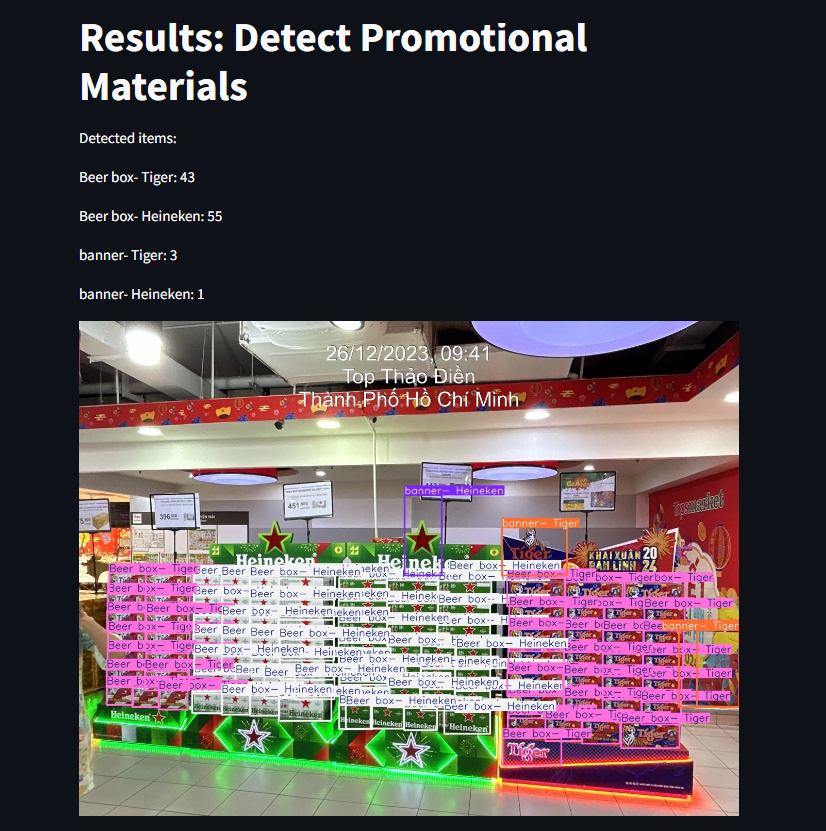
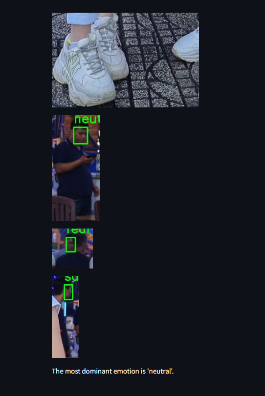
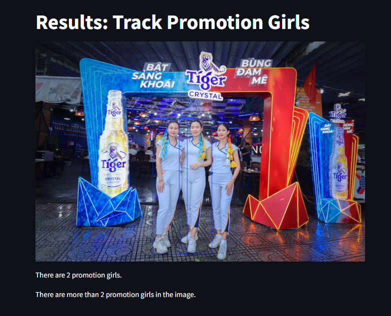
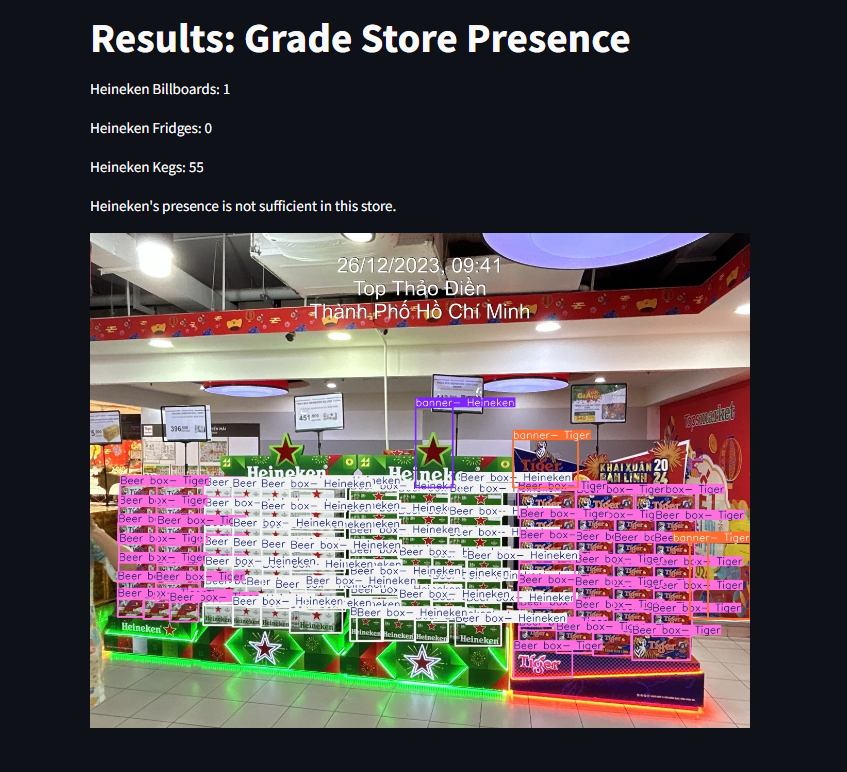

# Heineken Problem-Solving Application

## Overview

This application is designed by Team KTK to solve several business problems related to Heineken's marketing and presence at various points of sale. The app uses advanced image processing and machine learning techniques to analyze uploaded images and provide insights based on predefined business problems.

The application is built using Streamlit for the user interface and YOLOv8 models for object detection. It also uses the DeepFace library for facial emotion analysis.

## Business Problems

The application addresses the following business problems:

1. **Count Beer Drinkers**: Detects and counts how many people are drinking Heineken-brand beers in the images.
2. **Detect Promotional Materials**: Identifies and counts Heineken-branded promotional materials such as ice buckets, standees, umbrellas, and shelves.
3. **Evaluate Event Success**: Assesses the success of events by analyzing the size of the crowd and the mood of the attendees.
4. **Track Promotion Girls**: Identifies and verifies the presence of promotion girls at dining locations.
5. **Grade Store Presence**: Grades the quality of Heineken's presence at stores by ensuring the deployment of display concepts such as billboards, fridges, and kegs.

## Installation

To run this application, you need to have Python installed on your system. Follow these steps to set up the application:

1. **Clone the Repository**

    ```bash
    git clone https://github.com/Jun0se7en/HACKHCMC2024.git
    cd HACKHCMC2024
    ```

2. **Build Docker Container**

    ```bash
    docker build -t hcmcapp .
    ```

3. **Docker Run to Run The App**

    ```bash
    docker run -p 8051:8051 hcmcapp
    ```

4. **Run the Application via localhost**

    ```bash
    open browser and access localhost:8051
    ```

## Usage

1. **Upload an Image**: Use the file uploader to select an image for analysis.
2. **Select a Business Problem**: Choose one of the predefined business problems from the sidebar.
3. **Analyze**: Click the 'Analyze' button to run the analysis on the uploaded image.

## Project Structure

```
.
├── models
│   ├── beer_model.pt
│   ├── PG_model.pt
│   ├── posm_model.pt
│   ├── sit_stand_model.pt
├── utils.py
├── app.py
├── requirements.txt
└── README.md
```

## Example Screenshots

### Detect Promotional Materials


### Evaluate Event Success


### Track Promotion Girls


### Grade Store Presence


## Contributing

Contributions are welcome! Please open an issue or submit a pull request for any improvements or bug fixes.

## Demo Video

[a link](https://drive.google.com/file/d/1vQOXEvuzBbg69ytEgb7fxF-KccDPy10S/view?usp=sharing)

## Web Service

[a link](hackhcmc2024.azurewebsites.net)

## License

This project is licensed under the MIT License.

## Acknowledgements

- [Streamlit](https://streamlit.io/)
- [YOLOv8](https://github.com/ultralytics/yolov5)
- [DeepFace](https://github.com/serengil/deepface)
